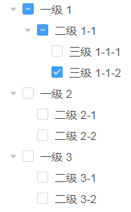

# 设置菜单状态

#### 接口描述：
- 设置菜单状态，同时会影响上级与下级菜单的状态。

#### 请求 URL：
- `http|https://host/api/v1/menu/method/set.menu.status/`

#### 请求方式：
- GET
- POST

#### 是否授权：
- 需要授权

#### 业务参数：
|参数名|类型|是否必须|范围值|默认值|示例值|描述|
|:----|:---|:---:|:-----|:-----|:-----|-----|
|menu_id |integer |是 |gt:0 | |35 |菜单编号 |
|status |integer |是 |in:0,1 | |1 |菜单状态  0=禁用 1=启用 |

#### 响应参数：
|参数名|类型|是否返回|示例值|描述|
|:-----|:-----|:---:|:-----|-----|
|status |integer |是 |200 |状态码 |
|message |string |是 |success |消息信息 |
|data |object |是 |[] |返回对象 |

|data|类型|是否返回|示例值|描述|
|:-----|:-----|:---:|:-----|-----|
|parent |array |是 |[1,2,3] |受影响的上级菜单编号 |
|children |array |是 |[4,5,6] |受影响的下级菜单编号，包括自身。 |
|status |integer |是 |1 |菜单状态  0=禁用 1=启用 |

#### 响应示例：
```json
{
  "status": 200,
  "message": "success",
  "data": {
    "parent": [31],
    "children": [35],
    "status": 1
  }
}
```

#### 备注:
1. 修改菜单状态后受影响的菜单编号其实与勾选 Tree 结构相同，没有特殊要求都不需要对 Tree 做特殊处理。   
