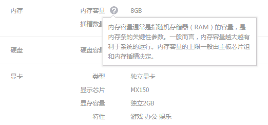

# 名词图解

+ `内存、硬盘、显卡`做为一个主体，在接口中叫`商品属性主体`。

+ 而主体`内存`中的`内存容量、插槽数量`做为主体中的属性，在接口中叫`商品属性`。

+ 向顾客解释词义时需要详细说明，那么`商品属性主体`和`商品属性`都可以添加编辑`description`参数值。

+ `商品属性主体`和`商品属性`的排序都是同类、独立进行的。例如`内存、硬盘、显卡`属于同类，根据排序值排序。而`类型、显卡芯片、显卡容量、特性`属于同类，并且独立依附于主体`显卡`下，他们的排序在这个独立范围内进行。PS：从接口获取到的数据已经过筛选和排序。

+ `商品属性主体`属于容器，而`商品属性`属于容器下的具体内容，所以他们二者是独立的。

+ `是否属于核心属性`，如果是一般在`商品详情`中出现，如下图：   

::: tip 提示
商品属性仅仅是显示使用的，也就是商品的参数，而商品的规格是参与价格，库存等变动的。
:::