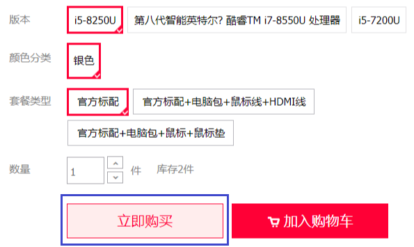

# 请求商品立即购买

#### 接口描述：
- 不加入购物车，而是直接进行购买操作，见备注中的示意图。

#### 请求 URL：
- `http|https://host/api/v1/cart/method/create.cart.buynow/`

#### 请求方式：
- GET
- POST

#### 是否授权：
- 需要授权

#### 业务参数：
|参数名|类型|是否必须|范围值|默认值|示例值|描述|
|:----|:---|:---:|:-----|:-----|:-----|-----|
|goods_id |integer |是 |gt:0 | |13 |商品编号 |
|goods_num |integer |是 |gt:0 | |2 |购买数量 |
|goods_spec |array |否 |minx[]:0 | |[1,3] |商品规格 |

#### 响应参数：
|参数名|类型|是否返回|示例值|描述|
|:-----|:-----|:---:|:-----|-----|
|status |integer |是 |200 |状态码 |
|message |string |是 |success |消息信息 |
|data |object |是 |[] |返回对象 |

|data|类型|是否返回|示例值|描述|
|:-----|:-----|:---:|:-----|-----|
|goods_id |integer |是 |13 |商品编号 |
|goods_num |integer |是 |2 |购买数量 |
|key_name |string |是 |1_3 |商品规格键名 |
|key_value |string |是 |颜色:黑色 CPU:I5 |商品规格值 |
|update_time |datetime |是 |2018-06-24 00:22:11 |更新时间 |
|cart_id |integer |是 |46 |购物车编号 |

#### 响应示例：
```json
{
  "status": 200,
  "message": "success",
  "data": {
    "goods_id": 13,
    "goods_num": 2,
    "key_name": "1_3",
    "key_value": "颜色:黑色 CPU:I5",
    "update_time": "2018-06-24 00:22:11",
    "cart_id": 46
  }
}
```

#### 备注:
立即购买示意图：


1. 接口返回数据后应当再次调用[「获取订单确认或提交订单」](/api/client/order/order/confirm.order.list.md "「获取订单确认或提交订单」")接口，进行`订单确认`操作。
